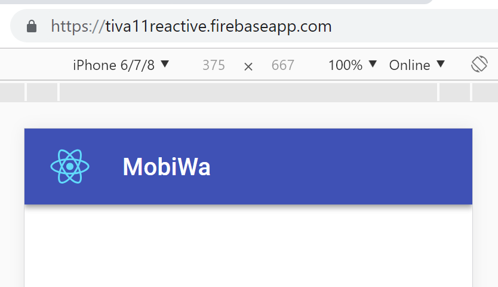

# t11mobiwa
A mobile warehousing solution for SAP B1 using Design1st with React/TypeScript/Material-UI/PWA

## Next Steps
I have reviewed Foormik, Final Form and especially Final Form is awesome. I have added a working sample application **reactfinalformmaterialuiexample.tsx** and the the next step would be to improve/extend it using real Material UI components from the [codesandbox sample](https://codesandbox.io/s/n4rvznnw0p) 
together with defining the data structures with react-define-form/TypeScript.
In the meantime, however, I've reviewed React Hooks, and I am pretty sure that for mobile applications they are more than enough. So, now I'm going to rework the pixabayfinder using React Hooks.
So this branch is put on hold now.

## Installation, Material UI Setup, Initial Deployment on Firebase Hosting
- **npx create-react-app t11mobiwa --typescript** 
This project was bootstrapped with [Create React App, which supports TypeScript out of the box](https://reactjs.org/docs/static-type-checking.html#using-typescript-with-create-react-app)
- Add ```<link rel="stylesheet" href="https://fonts.googleapis.com/css?family=Roboto:300,400,500">``` and ```<link rel="stylesheet" href="https://fonts.googleapis.com/icon?family=Material+Icons">``` to public/index.html
- **npm install @material-ui/core @material-ui/icons prop-types @types/prop-types** Prop Types was used in a number of Material UI examples. 
- **firebase login**
- **firebase init**
```
You're about to initialize a Firebase project in this directory:
  C:\Users\nemet\tiva11\t11mobiwa
? Are you ready to proceed? Yes
? Which Firebase CLI features do you want to setup for this folder? Press Space to select features, then Enter to confirm your
 choices. Functions: Configure and deploy Cloud Functions, Hosting: Configure and deploy Firebase Hosting sites
=== Project Setup
First, let's associate this project directory with a Firebase project.
You can create multiple project aliases by running firebase use --add,
but for now we'll just set up a default project.
? Select a default Firebase project for this directory: tiva11reactive (Tiva11Reactive)
i  Using project tiva11reactive (Tiva11Reactive)
=== Functions Setup
A functions directory will be created in your project with a Node.js
package pre-configured. Functions can be deployed with firebase deploy.
? What language would you like to use to write Cloud Functions? TypeScript
? Do you want to use TSLint to catch probable bugs and enforce style? No
+  Wrote functions/package.json
+  Wrote functions/tsconfig.json
+  Wrote functions/src/index.ts
+  Wrote functions/.gitignore
? Do you want to install dependencies with npm now? Yes
=== Hosting Setup
Your public directory is the folder (relative to your project directory) that
will contain Hosting assets to be uploaded with firebase deploy. If you
have a build process for your assets, use your build's output directory.
? What do you want to use as your public directory? build
? Configure as a single-page app (rewrite all urls to /index.html)? No
+  Wrote build/404.html
+  Wrote build/index.html
i  Writing configuration info to firebase.json...
i  Writing project information to .firebaserc...
+  Firebase initialization complete!
```
- **npm run build**
- **firebase deploy --only hosting**



## Adding Firebase Support
- **npm install firebase** for getting started with authentication. Firebase CLI was already installed.

## Adding Material UI Final Forms
I've created a branch addingmuiforms for experimenting with [React Final Forms](https://github.com/final-form/react-final-form) which is an integration of [Final Form](https://github.com/final-form) with React from the same author [Erik Rassmussen (Next Generation Forms with React Final Form)](https://www.youtube.com/watch?v=WoSzy-4mviQ).
I watched a number of videos about Formik, but I picked Final Forms because of its cleaner [integration with Material UI](https://github.com/final-form/react-final-form#material-ui-10); the sample [on codesandbox](https://codesandbox.io/s/2z5y03y81r) was written by erikras himself, and works with the latest Material UI right away.
[React Define Form](https://github.com/ForbesLindesay/define-form/tree/master/packages/react-define-form) is TypeScript package to create typed form data structures for Final Form, but it seems that it is abandoned by its author with a couple of issues. 
[Final Form Material UI (FFMUI)](https://github.com/Deadly0/final-form-material-ui) is a binding written in TypeScript between FF and MUI. This is a very simple package very similar to what is available in the codesandbox demo from erikras. [Issue #4](https://github.com/Deadly0/final-form-material-ui/issues/4) is about a nice example.
[Oliver Tassinari made a nice demo](https://codesandbox.io/s/9ywq085k9w) using the components from this project, but he didn't use the Select component either. Oliver used Grid to layout the elements, Typography, Paper and nice MUI Button components. I have [forked and extended this project on codesandbox](https://codesandbox.io/s/n4rvznnw0p) with a Select component, where the width was set with adding ```formControlProps={{ fullWidth: true }}``` to the Field. 

- **npm install react-final-form final-form final-form-material-ui react-define-form**

## Available Scripts
In the project directory, you can run:
### `npm start`

Runs the app in the development mode.<br>
Open [http://localhost:3000](http://localhost:3000) to view it in the browser.

The page will reload if you make edits.<br>
You will also see any lint errors in the console.

### `npm test`

Launches the test runner in the interactive watch mode.<br>
See the section about [running tests](https://facebook.github.io/create-react-app/docs/running-tests) for more information.

### `npm run build`

Builds the app for production to the `build` folder.<br>
It correctly bundles React in production mode and optimizes the build for the best performance.

The build is minified and the filenames include the hashes.<br>
Your app is ready to be deployed!

See the section about [deployment](https://facebook.github.io/create-react-app/docs/deployment) for more information.

### `npm run eject`

**Note: this is a one-way operation. Once you `eject`, you can’t go back!**

If you aren’t satisfied with the build tool and configuration choices, you can `eject` at any time. This command will remove the single build dependency from your project.

Instead, it will copy all the configuration files and the transitive dependencies (Webpack, Babel, ESLint, etc) right into your project so you have full control over them. All of the commands except `eject` will still work, but they will point to the copied scripts so you can tweak them. At this point you’re on your own.

You don’t have to ever use `eject`. The curated feature set is suitable for small and middle deployments, and you shouldn’t feel obligated to use this feature. However we understand that this tool wouldn’t be useful if you couldn’t customize it when you are ready for it.

## Learn More

The project was initialized with [create-react-app, which supports TypeScript out of the box](https://reactjs.org/docs/static-type-checking.html#using-typescript-with-create-react-app).
For [TypeScript](https://www.typescriptlang.org/samples/index.html) integration a terribly important feature of React is that its JSX has full support for type validation (unlike Vue templates). 

Here is a list of guidelines to start with React/TypeScript:
- [A remake of the Pixabay Finder demo application using TypeScript and Thinking-in-React Architecture](https://github.com/nemethmik/t11pixabayfinder)
- [The previous version of this project](https://github.com/nemethmik/t11mobiwa-deprecated), which has a number of excellent experimental sections from Microsoft TypeScript React Starter, the Clemex template.
- [React & Redux in TypeScript - Static Typing Guide by Piotr Witek](https://github.com/piotrwitek/react-redux-typescript-guide) This is quite actively maintained project
- [React Higher-Order Components in TypeScript by James Ravenscroft](https://medium.com/@jrwebdev/react-higher-order-component-patterns-in-typescript-42278f7590fb)
- [How to improve the build speed in React-Typescript, when using Material UI](https://dev.to/janpauldahlke/how-to-improve-material-ui-speed-in-react-typescript-1199)
- [Material UI Guide for TypeScript](https://material-ui.com/guides/typescript/)
- [Getting Started With React, TypeScript MobX, and Webpack 4](https://medium.com/teachable/getting-started-with-react-typescript-mobx-and-webpack-4-8c680517c030) MobX is said to be written in TypeScript.


You can learn more in the [Create React App documentation](https://facebook.github.io/create-react-app/docs/getting-started).

To learn React, check out the [React documentation](https://reactjs.org/).
